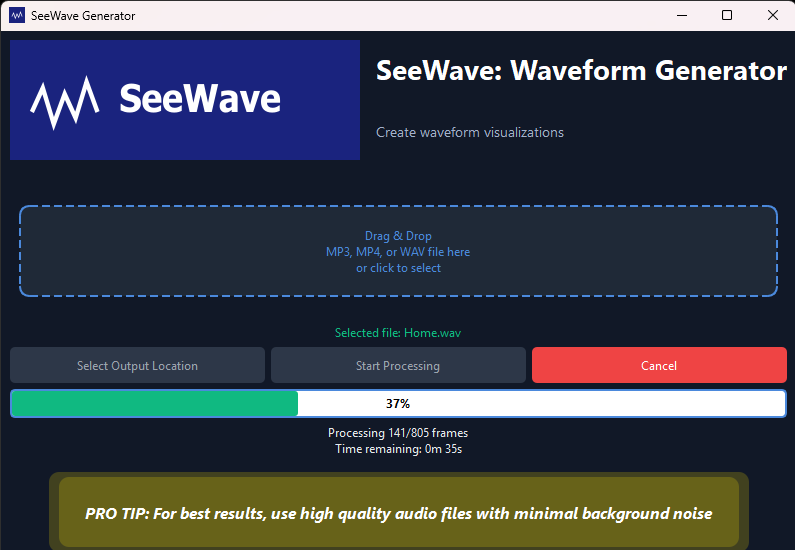

# SeeWav Audio Visualizer




An audio visualization tool that creates animated waveform videos from audio files. SeeWav transforms your audio into visual representations.

## Features

- Modern drag-and-drop interface for easy file selection
- Supports MP3, WAV, and extracts audio from video files
- Creates beautiful waveform animations with customizable colors
- Real-time progress tracking with frame counts and time estimates
- Choose custom output locations for your visualization videos
- Clean, modern dark blue interface with intuitive controls
- Stereo visualization support for immersive representations
- Background image support for personalized visualizations

## System Requirements

- Windows 10 or higher
- Python 3.8 or higher (3.12.7 recommended)
- FFmpeg installed and available in your system PATH

## Build Requirements

The following components are required to build the application from source:

- **Python 3.12.7** (or compatible version)
- **PyInstaller 6.12.0** (automatically installed by build script)
- **Virtual environment (venv)**
- **FFmpeg** installed on the system
- **MSYS2** with the UCRT64 environment (provides essential DLLs for Cairo)

### Required MSYS2 Libraries

MSYS2 provides the Cairo graphics library and related dependencies that are essential for the application to function properly. The following DLLs are automatically included from the MSYS2 UCRT64 environment during the build process:

- libcairo-2.dll
- libcairo-gobject-2.dll
- libgdk_pixbuf-2.0-0.dll
- libgio-2.0-0.dll
- libglib-2.0-0.dll
- libgobject-2.0-0.dll
- libgtk-4-1.dll
- libpango-1.0-0.dll
- libpangocairo-1.0-0.dll

### Python Packages

```
PyQt6==6.6.1
PyQt6-Qt6==6.6.1
PyQt6-sip==13.6.0
ffmpeg-python==0.2.0
numpy==1.26.4
Pillow==10.2.0
tqdm==4.66.2
pycairo==1.27.0
send2trash
```

## Installation

### Option 1: Download Pre-built Release

1. Download the latest release from the releases page
2. Extract the ZIP file to a location of your choice
3. Run `SeeWave.exe`

### Option 2: Build from Source

1. Clone or download this repository
2. Install Python 3.12.7 from [python.org](https://www.python.org/downloads/)
3. Install FFmpeg from [ffmpeg.org](https://ffmpeg.org/download.html) or using package managers like Chocolatey:
   ```
   choco install ffmpeg
   ```
4. Install MSYS2 from [msys2.org](https://www.msys2.org/) and set up the UCRT64 environment:
   ```
   # In MSYS2 UCRT64 shell
   pacman -Syu
   pacman -S mingw-w64-ucrt-x86_64-cairo mingw-w64-ucrt-x86_64-pango mingw-w64-ucrt-x86_64-gtk4
   ```
5. Ensure MSYS2's UCRT64 bin directory is in your PATH (typically `C:\msys64\ucrt64\bin`)
6. Set up a virtual environment:
   ```
   python -m venv venv
   .\venv\Scripts\activate
   ```
7. Install required dependencies:
   ```
   pip install -r requirements.txt
   ```
8. Build the executable:
   ```
   .\build.bat
   ```
9. The built application will be available in the `dist` folder

### Detailed Build Process

The `build.bat` script handles the following steps automatically:

1. Activates the Python virtual environment
2. Verifies the presence of required asset files (logo.png and image.svg)
3. Installs PyInstaller if needed
4. Cleans previous build artifacts
5. Builds the application using the seewav.spec configuration
6. The spec file:
   - Identifies the location of required DLLs from MSYS2
   - Bundles necessary resources and dependencies
   - Configures the application to run without a console window
   - Sets up the application icon

## Usage

### GUI Interface (Recommended)

1. Launch the application by double-clicking `SeeWave.exe` (or run `python main_gui.py` if using source)
2. Drag and drop an audio or video file onto the application window, or click to select a file
3. Click "Select output location" to choose where to save your visualization
4. Click "Start" to begin the visualization process
5. Monitor the progress with the status updates and progress bar
6. Once complete, your visualization video will be available at the selected location

### Command Line Interface

For advanced users who prefer command-line operations:

```
python seewav.py input_audio.mp3 output_video.mp4
```

For additional options:
```
python seewav.py --help
```

## Advanced Parameters

The command line version supports various customization options:

- `--rate` - Set the video framerate
- `--stereo` - Create 2 waveforms for stereo audio files
- `--color` - Set the waveform color (RGB format)
- `--color2` - Set the color for second waveform in stereo mode
- `--background` - Set background color (RGB format)
- `--image` - Use a custom background image
- `--bars` - Adjust number of waveform bars
- `--width` and `--height` - Set output video dimensions
- `--speed` - Control transition speed between frames
- `--time` - Amount of audio shown at once on a frame

## Troubleshooting

- **FFmpeg not found**: Ensure FFmpeg is properly installed and added to your system PATH
- **Application icon not showing**: Clear your icon cache or restart Windows Explorer
- **Slow performance**: Try reducing the video dimensions or framerate
- **Missing DLLs errors**: Verify MSYS2 is properly installed with the required libraries
- **Cairo-related errors**: Make sure pycairo is installed correctly and MSYS2 libraries are accessible

## Credits

Based on the original seewav project by Alexandre Défossez.
GUI enhancements and additional features added in 2025.

## License

This project is licensed under the terms of the Unlicense license. 
